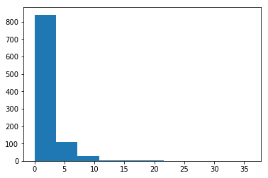

Before we get started, a couple of reminders to keep in mind when using iPython notebooks:

- Remember that you can see from the left side of a code cell when it was last run if there is a number within the brackets.
- When you start a new notebook session, make sure you run all of the cells up to the point where you last left off. Even if the output is still visible from when you ran the cells in your previous session, the kernel starts in a fresh state so you'll need to reload the data, etc. on a new session.
- The previous point is useful to keep in mind if your answers do not match what is expected in the lesson's quizzes. Try reloading the data and run all of the processing steps one by one in order to make sure that you are working with the same variables and data that are at each quiz stage.


## Load Data from CSVs


```python
import unicodecsv

## Longer version of code (replaced with shorter, equivalent version below)

#enrollments = []
# f = open('enrollments.csv', 'rb')
# reader = unicodecsv.DictReader(f)
# for row in reader:
#     enrollments.append(row)
# f.close()

with open('enrollments.csv', 'rb') as f:
    reader = unicodecsv.DictReader(f)
    enrollments = list(reader)
print (enrollments [0])
```

    OrderedDict([('account_key', '448'), ('status', 'canceled'), ('join_date', '2014-11-10'), ('cancel_date', '2015-01-14'), ('days_to_cancel', '65'), ('is_udacity', 'True'), ('is_canceled', 'True')])
    


```python
#####################################
#                 1                 #
#####################################

## Read in the data from daily_engagement.csv and project_submissions.csv 
## and store the results in the below variables.
## Then look at the first row of each table.

with open ('daily_engagement.csv', 'rb') as f:
    reader = unicodecsv.DictReader(f)
    daily_engagement = list(reader)

with open ('project_submissions.csv', 'rb') as f:
    reader = unicodecsv.DictReader(f)
    project_submissions = list(reader)
    
print (daily_engagement[0])   
print (project_submissions[0])
```

    OrderedDict([('acct', '0'), ('utc_date', '2015-01-09'), ('num_courses_visited', '1.0'), ('total_minutes_visited', '11.6793745'), ('lessons_completed', '0.0'), ('projects_completed', '0.0')])
    OrderedDict([('creation_date', '2015-01-14'), ('completion_date', '2015-01-16'), ('assigned_rating', 'UNGRADED'), ('account_key', '256'), ('lesson_key', '3176718735'), ('processing_state', 'EVALUATED')])
    

## Fixing Data Types


```python
from datetime import datetime

# Takes a date as a string, and returns a Python datetime object. 
# If there is no date given, returns None
def parse_date(date):
    if date == '':
        return None
    else:
        return datetime.strptime(date,'%Y-%m-%d')
    
# Takes a string which is either an empty string or represents an integer,
# and returns an int or None.
def parse_maybe_int(i):
    if i == '':
        return None
    else:
        return int(i)

# Clean up the data types in the enrollments table
for enrollment in enrollments:
    enrollment['cancel_date'] = parse_date(enrollment['cancel_date'])
    enrollment['days_to_cancel'] = parse_maybe_int(enrollment['days_to_cancel'])
    enrollment['is_canceled'] = enrollment['is_canceled'] == 'True'
    enrollment['is_udacity'] = enrollment['is_udacity'] == 'True'
    enrollment['join_date'] = parse_date(enrollment['join_date'])
    
enrollments[0]
```


    OrderedDict([('account_key', '448'),
                 ('status', 'canceled'),
                 ('join_date', datetime.datetime(2014, 11, 10, 0, 0)),
                 ('cancel_date', datetime.datetime(2015, 1, 14, 0, 0)),
                 ('days_to_cancel', 65),
                 ('is_udacity', True),
                 ('is_canceled', True)])


```python
print (enrollments[0])
```

    OrderedDict([('account_key', '448'), ('status', 'canceled'), ('join_date', datetime.datetime(2014, 11, 10, 0, 0)), ('cancel_date', datetime.datetime(2015, 1, 14, 0, 0)), ('days_to_cancel', 65), ('is_udacity', True), ('is_canceled', True)])
    


```python
# Clean up the data types in the engagement table
for engagement_record in daily_engagement:
    engagement_record['lessons_completed'] = int(float(engagement_record['lessons_completed']))
    engagement_record['num_courses_visited'] = int(float(engagement_record['num_courses_visited']))
    engagement_record['projects_completed'] = int(float(engagement_record['projects_completed']))
    engagement_record['total_minutes_visited'] = float(engagement_record['total_minutes_visited'])
    engagement_record['utc_date'] = parse_date(engagement_record['utc_date'])
    
daily_engagement[0]
```


    OrderedDict([('acct', '0'),
                 ('utc_date', datetime.datetime(2015, 1, 9, 0, 0)),
                 ('num_courses_visited', 1),
                 ('total_minutes_visited', 11.6793745),
                 ('lessons_completed', 0),
                 ('projects_completed', 0)])


```python
# Clean up the data types in the submissions table
for submission in project_submissions:
    submission['completion_date'] = parse_date(submission['completion_date'])
    submission['creation_date'] = parse_date(submission['creation_date'])

project_submissions[0]
```


    OrderedDict([('creation_date', datetime.datetime(2015, 1, 14, 0, 0)),
                 ('completion_date', datetime.datetime(2015, 1, 16, 0, 0)),
                 ('assigned_rating', 'UNGRADED'),
                 ('account_key', '256'),
                 ('lesson_key', '3176718735'),
                 ('processing_state', 'EVALUATED')])


Note when running the above cells that we are actively changing the contents of our data variables. If you try to run these cells multiple times in the same session, an error will occur.

## Investigating the Data


```python
#####################################
#                 2                 #
#####################################

## Find the total number of rows and the number of unique students (account keys)
## in each table.

#defining read_csv function to read multiple files
def read_csv(filename):
    with open(filename, 'rb') as f:
        reader = unicodecsv.DictReader(f)
        return list(reader)

#defining csv files to be read
#enrollments = read_csv('enrollments.csv')
#daily_engagement = read_csv('daily_engagement.csv')
#project_submissions = read_csv('project_submissions.csv')
    
#use len function to determine number of rows    
enrollment_num_rows = len(enrollments) 

#create a set and add in all the account_keys in the csv. 
enrollment_num_unique_students = set()
for enrollment in enrollments:
    enrollment_num_unique_students.add(enrollment['account_key'])

engagement_num_rows = len(daily_engagement)
engagement_num_unique_students = set()  
for engagement in daily_engagement:
    engagement_num_unique_students.add(engagement['acct'])

submission_num_rows = len(project_submissions)
submission_num_unique_students = set()  
for project in project_submissions:
    submission_num_unique_students.add(project['account_key'])

# printing results
print (enrollment_num_rows)
print (len(enrollment_num_unique_students))
print (engagement_num_rows)
print (len(engagement_num_unique_students))
print (submission_num_rows)
print (len(submission_num_unique_students))
```

    1640
    1302
    136240
    1237
    3642
    743
    

## Problems in the Data


```python
#####################################
#                 3                 #
#####################################

## Rename the "acct" column in the daily_engagement table to "account_key".
for engagement_record in daily_engagement:
    engagement_record['account_key'] = engagement_record['acct']
    del engagement_record['acct']

print (daily_engagement[0]['account_key'])
```

    0
    


```python
# updated function for counting number of unique students

# defining function get_unique_students
def get_unique_students(data):
    unique_students = set()
    for data_point in data:
        unique_students.add(data_point['account_key'])
    return unique_students

print (len(enrollments))
unique_enrolled_students = get_unique_students(enrollments)
print (len (unique_enrolled_students))

print (len(daily_engagement))
unique_engagement_students = get_unique_students(daily_engagement)
print (len(unique_engagement_students))

print (len(project_submissions))
unique_project_submitters = get_unique_students(project_submissions)
print (len(unique_project_submitters))
```

    1640
    1302
    136240
    1237
    3642
    743
    

## Missing Engagement Records


```python
#####################################
#                 4                 #
#####################################

## Find any one student enrollments where the student is missing from the daily engagement table.
## Output that enrollment.

for enrollment in enrollments:
    student = enrollment['account_key']
    if student not in unique_engagement_students:
        print (enrollment)
        break
    


```

    OrderedDict([('account_key', '1219'), ('status', 'canceled'), ('join_date', datetime.datetime(2014, 11, 12, 0, 0)), ('cancel_date', datetime.datetime(2014, 11, 12, 0, 0)), ('days_to_cancel', 0), ('is_udacity', False), ('is_canceled', True)])
    

## Checking for More Problem Records


```python
#####################################
#                 5                 #
#####################################

## Find the number of surprising data points (enrollments missing from
## the engagement table) that remain, if any.

no_engagement = 0
for enrollment in enrollments:
    student = enrollment['account_key']
    if student not in unique_engagement_students \
            and enrollment['join_date'] != enrollment['cancel_date']:
            no_engagement += 1
            print (enrollment)
print (no_engagement)
```

    OrderedDict([('account_key', '1304'), ('status', 'canceled'), ('join_date', datetime.datetime(2015, 1, 10, 0, 0)), ('cancel_date', datetime.datetime(2015, 3, 10, 0, 0)), ('days_to_cancel', 59), ('is_udacity', True), ('is_canceled', True)])
    OrderedDict([('account_key', '1304'), ('status', 'canceled'), ('join_date', datetime.datetime(2015, 3, 10, 0, 0)), ('cancel_date', datetime.datetime(2015, 6, 17, 0, 0)), ('days_to_cancel', 99), ('is_udacity', True), ('is_canceled', True)])
    OrderedDict([('account_key', '1101'), ('status', 'current'), ('join_date', datetime.datetime(2015, 2, 25, 0, 0)), ('cancel_date', None), ('days_to_cancel', None), ('is_udacity', True), ('is_canceled', False)])
    3
    

## Tracking Down the Remaining Problems


```python
# Create a set of the account keys for all Udacity test accounts
udacity_test_accounts = set()
for enrollment in enrollments:
    if enrollment['is_udacity']:
        udacity_test_accounts.add(enrollment['account_key'])
len(udacity_test_accounts)
```


    6


```python
# Given some data with an account_key field, removes any records corresponding to Udacity test accounts
def remove_udacity_accounts(data):
    non_udacity_data = []
    for data_point in data:
        if data_point['account_key'] not in udacity_test_accounts:
            non_udacity_data.append(data_point)
    return non_udacity_data
```


```python
# Remove Udacity test accounts from all three tables
non_udacity_enrollments = remove_udacity_accounts(enrollments)
non_udacity_engagement = remove_udacity_accounts(daily_engagement)
non_udacity_submissions = remove_udacity_accounts(project_submissions)

print (len(non_udacity_enrollments))
print (len(non_udacity_engagement))
print (len(non_udacity_submissions))
```

    1622
    135656
    3634
    

## Refining the Question


```python
#####################################
#                 6                 #
#####################################

## Create a dictionary named paid_students containing all students who either
## haven't canceled yet or who remained enrolled for more than 7 days. The keys
## should be account keys, and the values should be the date the student enrolled.

paid_students = {}

for enrollment in non_udacity_enrollments:
    if not enrollment['is_canceled'] or enrollment['days_to_cancel'] > 7:
        account_key = enrollment['account_key']
        enrollment_date = enrollment['join_date']
        
        if account_key not in paid_students or enrollment_date > paid_students[account_key]:
            paid_students[account_key] = enrollment_date
        

print (len(paid_students))
```

    995
    

## Getting Data from First Week


```python
# Takes a student's join date and the date of a specific engagement record,
# and returns True if that engagement record happened within one week
# of the student joining.
def within_one_week(join_date, engagement_date):
    time_delta = engagement_date - join_date
    return time_delta.days < 7 and time_delta.days >=0
```


```python
#####################################
#                 7                 #
#####################################

## Create a list of rows from the engagement table including only rows where
## the student is one of the paid students you just found, and the date is within
## one week of the student's join date.

def remove_free_trial_cancels(data):
    new_data = []
    for data_point in data:
        if data_point['account_key'] in paid_students:
            new_data.append(data_point)
    return new_data

paid_enrollments = remove_free_trial_cancels(non_udacity_enrollments)
paid_engagement = remove_free_trial_cancels(non_udacity_engagement)
paid_submission = remove_free_trial_cancels(non_udacity_submissions)

print (len(paid_enrollments))
print (len(paid_engagement))
print (len(paid_submission))
```

    1293
    134549
    3618
    


```python
for engagement_record in paid_engagement:
    if engagement_record['num_courses_visited'] > 0:
        engagement_record['has_visited'] = 1
    else:
        engagement_record['has_visited'] = 0
```


```python
paid_engagement_in_first_week = []

for engagement_record in paid_engagement:
    account_key = engagement_record['account_key']
    join_date = paid_students[account_key]
    engagement_record_date = engagement_record['utc_date']
    
    if within_one_week(join_date, engagement_record_date):
        paid_engagement_in_first_week.append(engagement_record)
        
print (len(paid_engagement_in_first_week))
```

    6919
    

## Exploring Student Engagement


```python
from collections import defaultdict

# Create a dictionary of engagement grouped by student.
# The keys are account keys, and the values are lists of engagement records.
engagement_by_account = defaultdict(list)
for engagement_record in paid_engagement_in_first_week:
    account_key = engagement_record['account_key']
    engagement_by_account[account_key].append(engagement_record)
```


```python
# Create a dictionary with the total minutes each student spent in the classroom during the first week.
# The keys are account keys, and the values are numbers (total minutes)
total_minutes_by_account = {}
for account_key, engagement_for_student in engagement_by_account.items():
    total_minutes = 0
    for engagement_record in engagement_for_student:
        total_minutes += engagement_record['total_minutes_visited']
    total_minutes_by_account[account_key] = total_minutes
```


```python
import numpy as np

# Summarize the data about minutes spent in the classroom
total_minutes = total_minutes_by_account.values()
print ('Mean', np.mean(list(total_minutes)))
print ('Standard deviation:', np.std(list(total_minutes)))
print ('Minimum:', np.min(list(total_minutes)))
print ('Maximum:', np.max(list(total_minutes)))
```

    Mean 306.708326753
    Standard deviation: 412.996933409
    Minimum: 0.0
    Maximum: 3564.7332645
    

## Debugging Data Analysis Code


```python
#####################################
#                 8                 #
#####################################

## Go through a similar process as before to see if there is a problem.
## Locate at least one surprising piece of data, output it, and take a look at it.

student_with_max_minutes = None
max_minutes = 0

for student, total_minutes in total_minutes_by_account.items():
    if total_minutes > max_minutes:
        max_minutes = total_minutes
        student_with_max_minutes = student
        
for engagement_record in paid_engagement_in_first_week:
    if engagement_record['account_key'] == student_with_max_minutes:
        print (engagement_record)
```

    OrderedDict([('utc_date', datetime.datetime(2015, 7, 9, 0, 0)), ('num_courses_visited', 4), ('total_minutes_visited', 850.519339666), ('lessons_completed', 4), ('projects_completed', 0), ('account_key', '163'), ('has_visited', 1)])
    OrderedDict([('utc_date', datetime.datetime(2015, 7, 10, 0, 0)), ('num_courses_visited', 6), ('total_minutes_visited', 872.633923334), ('lessons_completed', 6), ('projects_completed', 0), ('account_key', '163'), ('has_visited', 1)])
    OrderedDict([('utc_date', datetime.datetime(2015, 7, 11, 0, 0)), ('num_courses_visited', 2), ('total_minutes_visited', 777.018903666), ('lessons_completed', 6), ('projects_completed', 0), ('account_key', '163'), ('has_visited', 1)])
    OrderedDict([('utc_date', datetime.datetime(2015, 7, 12, 0, 0)), ('num_courses_visited', 1), ('total_minutes_visited', 294.568774), ('lessons_completed', 2), ('projects_completed', 0), ('account_key', '163'), ('has_visited', 1)])
    OrderedDict([('utc_date', datetime.datetime(2015, 7, 13, 0, 0)), ('num_courses_visited', 3), ('total_minutes_visited', 471.2139785), ('lessons_completed', 1), ('projects_completed', 0), ('account_key', '163'), ('has_visited', 1)])
    OrderedDict([('utc_date', datetime.datetime(2015, 7, 14, 0, 0)), ('num_courses_visited', 2), ('total_minutes_visited', 298.778345333), ('lessons_completed', 1), ('projects_completed', 0), ('account_key', '163'), ('has_visited', 1)])
    OrderedDict([('utc_date', datetime.datetime(2015, 7, 15, 0, 0)), ('num_courses_visited', 0), ('total_minutes_visited', 0.0), ('lessons_completed', 0), ('projects_completed', 0), ('account_key', '163'), ('has_visited', 0)])
    

## Lessons Completed in First Week


```python
#####################################
#                 9                 #
#####################################

## Adapt the code above to find the mean, standard deviation, minimum, and maximum for
## the number of lessons completed by each student during the first week. Try creating
## one or more functions to re-use the code above.

from collections import defaultdict

def group_data(data, key_name):
    grouped_data = defaultdict(list)
    for data_point in data:
        key = data_point[key_name]
        grouped_data[key].append(data_point)
    return grouped_data

engagement_by_account = group_data(paid_engagement_in_first_week, 'account_key')

def sum_grouped_items(grouped_data, field_name):
    summed_data = {}
    
    for key, data_points in grouped_data.items():
        total = 0
        for data_point in data_points:
            total += data_point[field_name]
        summed_data[key] = total
    return summed_data

total_minutes_by_account = sum_grouped_items(engagement_by_account, 'total_minutes_visited')

%pylab inline
import matplotlib.pyplot as plt
import numpy as np

def describe_data(data):
    print ('Mean', np.mean(list(data)))
    print ('Standard deviation:', np.std(list(data)))
    print ('Minimum:', np.min(list(data)))
    print ('Maximum:', np.max(list(data)))
    plt.hist(list(data))

total_minutes = total_minutes_by_account.values()

lessons_completed_by_account = sum_grouped_items(engagement_by_account, 'lessons_completed')
describe_data(lessons_completed_by_account.values())

```

    Populating the interactive namespace from numpy and matplotlib
    Mean 1.63618090452
    Standard deviation: 3.00256129983
    Minimum: 0
    Maximum: 36
    





## Number of Visits in First Week


```python
######################################
#                 10                 #
######################################

## Find the mean, standard deviation, minimum, and maximum for the number of
## days each student visits the classroom during the first week.

days_visited_by_account = sum_grouped_items(engagement_by_account, 'has_visited')
describe_data(days_visited_by_account.values())
```

    Mean 2.86733668342
    Standard deviation: 2.25519800292
    Minimum: 0
    Maximum: 7
    

## Splitting out Passing Students


```python
######################################
#                 11                 #
######################################

## Create two lists of engagement data for paid students in the first week.
## The first list should contain data for students who eventually pass the
## subway project, and the second list should contain data for students
## who do not.

# find how many students passed the subway project
pass_subway_project = set()
subway_project_lesson_keys = ['746169184', '3176718735']
passing_score = ['PASSED', 'DISTINCTION']

for submission in paid_submission:
    project = submission['lesson_key']
    rating = submission['assigned_rating']
    
    if project in subway_project_lesson_keys and \
            rating in passing_score:
        pass_subway_project.add(submission['account_key'])
    
print (len(pass_subway_project))

# find how many engagements students who passed the subway project performed
# find how many engagements students who did not pass the subway project performed
passing_engagement = []
non_passing_engagement = []

for engagement_record in paid_engagement_in_first_week:
    if engagement_record['account_key'] in pass_subway_project:
        passing_engagement.append(engagement_record)
    else:
        non_passing_engagement.append(engagement_record)
print (len(passing_engagement))
print (len(non_passing_engagement))
```

    647
    4527
    2392
    

## Comparing the Two Student Groups


```python
######################################
#                 12                 #
######################################

## Compute some metrics you're interested in and see how they differ for
## students who pass the subway project vs. students who don't. A good
## starting point would be the metrics we looked at earlier (minutes spent
## in the classroom, lessons completed, and days visited

# comparing minutes spent between the groups of students who passed and did not pass the subway project

passing_engagement_by_account = group_data(passing_engagement, 'account_key')
non_passing_engagement_by_account = group_data(non_passing_engagement, 'account_key')

print ('Passing Students:')
passing_minutes = sum_grouped_items(passing_engagement_by_account, 'total_minutes_visited')
describe_data(passing_minutes.values())

print ('Non Passing Students:')
non_passing_minutes = sum_grouped_items(non_passing_engagement_by_account, 'total_minutes_visited')
describe_data(non_passing_minutes.values())


```

    Passing Students:
    Mean 394.586046484
    Standard deviation: 448.499519327
    Minimum: 0.0
    Maximum: 3564.7332645
    Non Passing Students:
    Mean 143.326474267
    Standard deviation: 269.538619011
    Minimum: 0.0
    Maximum: 1768.52274933
    


## Making Histograms


```python
######################################
#                 13                 #
######################################

## Make histograms of the three metrics we looked at earlier for both
## students who passed the subway project and students who didn't. You
## might also want to make histograms of any other metrics you examined.

#minutes spent histogram comparison
describe_data(passing_minutes.values())
describe_data(non_passing_minutes.values())

```

    Mean 394.586046484
    Standard deviation: 448.499519327
    Minimum: 0.0
    Maximum: 3564.7332645
    Mean 143.326474267
    Standard deviation: 269.538619011
    Minimum: 0.0
    Maximum: 1768.52274933
    


```python
#lessons completed histogram

passing_engagement_by_account = group_data(passing_engagement, 'account_key')
non_passing_engagement_by_account = group_data(non_passing_engagement, 'account_key')

print ('Passing Students:')
passing_lessons = sum_grouped_items(passing_engagement_by_account, 'lessons_completed')
describe_data(passing_lessons.values())

print ('Non Passing Students:')
non_passing_lessons = sum_grouped_items(non_passing_engagement_by_account, 'lessons_completed')
describe_data(non_passing_lessons.values())

```

    Passing Students:
    Mean 2.05255023184
    Standard deviation: 3.14222705558
    Minimum: 0
    Maximum: 36
    Non Passing Students:
    Mean 0.862068965517
    Standard deviation: 2.54915994183
    Minimum: 0
    Maximum: 27
    


```python
#days logged in
passing_engagement_by_account = group_data(passing_engagement, 'account_key')
non_passing_engagement_by_account = group_data(non_passing_engagement, 'account_key')

print ('Passing Students:')
passing_days = sum_grouped_items(passing_engagement_by_account, 'has_visited')
describe_data(passing_days.values())

print ('Non Passing Students:')
non_passing_days = sum_grouped_items(non_passing_engagement_by_account, 'has_visited')
describe_data(non_passing_days.values())

```

    Passing Students:
    Mean 3.38485316847
    Standard deviation: 2.25882147092
    Minimum: 0
    Maximum: 7
    Non Passing Students:
    Mean 1.90517241379
    Standard deviation: 1.90573144136
    Minimum: 0
    Maximum: 7
    


## Improving Plots and Sharing Findings


```python
######################################
#                 14                 #
######################################

## Make a more polished version of at least one of your visualizations
## from earlier. Try importing the seaborn library to make the visualization
## look better, adding axis labels and a title, and changing one or more
## arguments to the hist() function.

import seaborn as sns

plt.xlabel("Lessons Passed")
plt.ylabel("Number of Students")
plt.hist(list(passing_minutes.values()), bins=20)
plt.hist(list(non_passing_minutes.values()), bins=20)
```


    (array([ 226.,   46.,   21.,   13.,   12.,    5.,    1.,    8.,    3.,
               3.,    2.,    0.,    1.,    0.,    1.,    4.,    0.,    0.,
               0.,    2.]),
     array([    0.        ,    88.42613747,   176.85227493,   265.2784124 ,
              353.70454987,   442.13068733,   530.5568248 ,   618.98296227,
              707.40909973,   795.8352372 ,   884.26137467,   972.68751213,
             1061.1136496 ,  1149.53978707,  1237.96592453,  1326.392062  ,
             1414.81819947,  1503.24433693,  1591.6704744 ,  1680.09661187,
             1768.52274933]),
     <a list of 20 Patch objects>)


